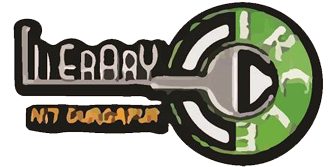

<!-- PROJECT SHIELDS -->
<!--
*** I'm using markdown "reference style" links for readability.
*** Reference links are enclosed in brackets [ ] instead of parentheses ( ).
*** See the bottom of this document for the declaration of the reference variables
*** for contributors-url, forks-url, etc. This is an optional, concise syntax you may use.
*** https://www.markdownguide.org/basic-syntax/#reference-style-links
-->


[![Contributors][contributors-shield]][contributors-url]
[![Forks][forks-shield]][forks-url]
[![Stargazers][stars-shield]][stars-url]
[![Issues][issues-shield]][issues-url]
[![MIT License][license-shield]][license-url]


<!-- PROJECT LOGO -->
<br />
<p align="center">
  <a href="https://github.com/othneildrew/Best-README-Template">
    
  </a>

  <h3 align="center">Audition Portal</h3>

  <p align="center">
     <i>Dynamic website built for conducting 2021 Literary Circle, NIT Durgapur auditions</i>
    <br />
  </p>
</p>


<!-- TABLE OF CONTENTS -->
<details open="open">
  <summary>Table of Contents</summary>
  <ol>
    <li>
      <a href="#about-the-project">About The Project</a>
      <ul>
        <li><a href="#built-with">Built With</a></li>
      </ul>
    </li>
    <li>
      <a href="#getting-started">Getting Started</a>
      <ul>
        <li><a href="#prerequisites">Prerequisites</a></li>
        <li><a href="#installation">Installation</a></li>
      </ul>
    </li>
    <li><a href="#usage">Usage</a></li>
    <li><a href="#contact">Contact</a></li>
  </ol>
</details>


<!-- ABOUT THE PROJECT -->
## About The Project

[![Product Name Screen Shot][product-screenshot]](lc-2021-auditions.vercel.app)

An audition portal to dynamically create questions which are stored in a database.The candidates can answer the questions and club members can review responses of each candidate . An admin panel is created using React to review each response and create/update/delete questions . Questions and responses are stored in a mongoDB database which interact with the React frontend using an Express.js created API with token based user authentication .

### Built With

The project utilises the following technologies :

* [React](https://reactjs.org/)
* [Bootstrap](https://getbootstrap.com/)
* [Node](https://nodejs.org/en/)
* [Express](https://expressjs.com/)
* [MongoDB](https://www.mongodb.com)


<!-- GETTING STARTED -->
## Getting Started

To get a local copy up and running follow these simple example steps.

### Prerequisites

* Install [Node](https://nodejs.org/en/)
* Install npm by runnning the following command on the terminal :

  ```sh
  npm install npm@latest -g
  ```
* Install [MongoDB](https://docs.mongodb.com/manual/installation/)

### Installation

1. Generate Google Client Id and Google client secret by creating a project on [Google Developers Console](https://console.cloud.google.com/).
2. Create a project on [MongoDB Atlas](https://www.mongodb.com/cloud/atlas) and get the connection URL to the cluster.
3. Clone the repo
   ```sh
   git clone https://github.com/lcnitdgp/LC-2021-auditions.git
   ```
3. Install NPM packages in the root, client and server directory.
   ```sh
   npm install
   cd client && npm install
   cd server && npm install
   ```
4. Create .env files in both the client and server folders(to add the environment variables) and copy the following content into each :

    Client directory .env file :
    ```sh
        #Add the backend URL, ex - http://localhost:5000
        REACT_APP_BACKEND_URL=
     ```
        
    Server directory .env file :
    ```sh
        #Add the Google Client Id
        GOOGLE_OAUTH_CLIENT_ID=
        
        #Add the Google Client Secret
        GOOGLE_OAUTH_CLIENT_SECRET=
        
        #Add the Google callback has to be the same which was passed in the google console, ex - http://localhost:5000/auth/google/redirect
        GOOGLE_CALLBACK=
        
        #Secret to sign the JWT token , can be any random string
        SECRET=
        
        #Add the frontend URL, ex - http://localhost:3000
        FRONTEND=
        
        #Add the mongoDB connnection URL
        MONGO=
     ```
  5. To run the project run the following command in the *root* directory.
      ```sh
      npm start
      ```
    

<!-- USAGE EXAMPLES -->
## Usage
A user who is an admin can create/update/delete questions which are correspondingly changed in the mongodb database. An admin user can also view the responses
of each candidate and make other users an admin as well . A normal user can simply alter his profile and only **once** submit a response .

![usage-1]
![usage-2]
![usage-3]
![usage-4]
![usage-5]
![usage-6]
![usage-7]

<!-- CONTRIBUTING -->
## Contributing

Contributions are what make the open source community such an amazing place to be learn, inspire, and create. Any contributions you make are **greatly appreciated**.

1. Fork the Project
2. Create your Feature Branch (`git checkout -b feature/AmazingFeature`)
3. Commit your Changes (`git commit -m 'Add some AmazingFeature'`)
4. Push to the Branch (`git push origin feature/AmazingFeature`)
5. Open a Pull Request


<!-- LICENSE -->
## License

Distributed under the MIT License. See `LICENSE` for more information.


<!-- CONTACT -->
## Contact

Email : lcnitd@gmail.com

Project Link: [https://github.com/lcnitdgp/LC-2021-auditions](https://github.com/lcnitdgp/LC-2021-auditions)


<!-- ACKNOWLEDGEMENTS -->
## Acknowledgements
* [Img Shields](https://shields.io)
* [Choose an Open Source License](https://choosealicense.com)
* [Vercel](https://vercel.com/dashboard)
* [Font Awesome](https://fontawesome.com)
* [Passport](http://www.passportjs.org)


<!-- MARKDOWN LINKS & IMAGES -->
<!-- https://www.markdownguide.org/basic-syntax/#reference-style-links -->
[contributors-shield]: https://img.shields.io/github/contributors/lcnitdgp/LC-2021-auditions.svg?style=for-the-badge
[contributors-url]: https://github.com/lcnitdgp/LC-2021-auditions/graphs/contributors

[forks-shield]: https://img.shields.io/github/forks/lcnitdgp/LC-2021-auditions.svg?style=for-the-badge
[forks-url]: https://github.com/lcnitdgp/LC-2021-auditions/network/members

[stars-shield]: https://img.shields.io/github/stars/lcnitdgp/LC-2021-auditions.svg?style=for-the-badge
[stars-url]: https://github.com/lcnitdgp/LC-2021-auditions/stargazers

[issues-shield]: https://img.shields.io/github/issues/lcnitdgp/LC-2021-auditions.svg?style=for-the-badge
[issues-url]: https://github.com/lcnitdgp/LC-2021-auditions/issues

[license-shield]: https://img.shields.io/github/license/lcnitdgp/LC-2021-auditions.svg?style=for-the-badge
[license-url]: https://github.com/lcnitdgp/LC-2021-auditions/LICENSE.txt

[product-screenshot]: images/screenshot.png
[usage-1]: images/usage-1.png
[usage-2]: images/usage-2.png
[usage-3]: images/usage-3.png
[usage-4]: images/usage-4.png
[usage-5]: images/usage-5.png
[usage-6]: images/usage-6.png
[usage-7]: images/usage-7.png


